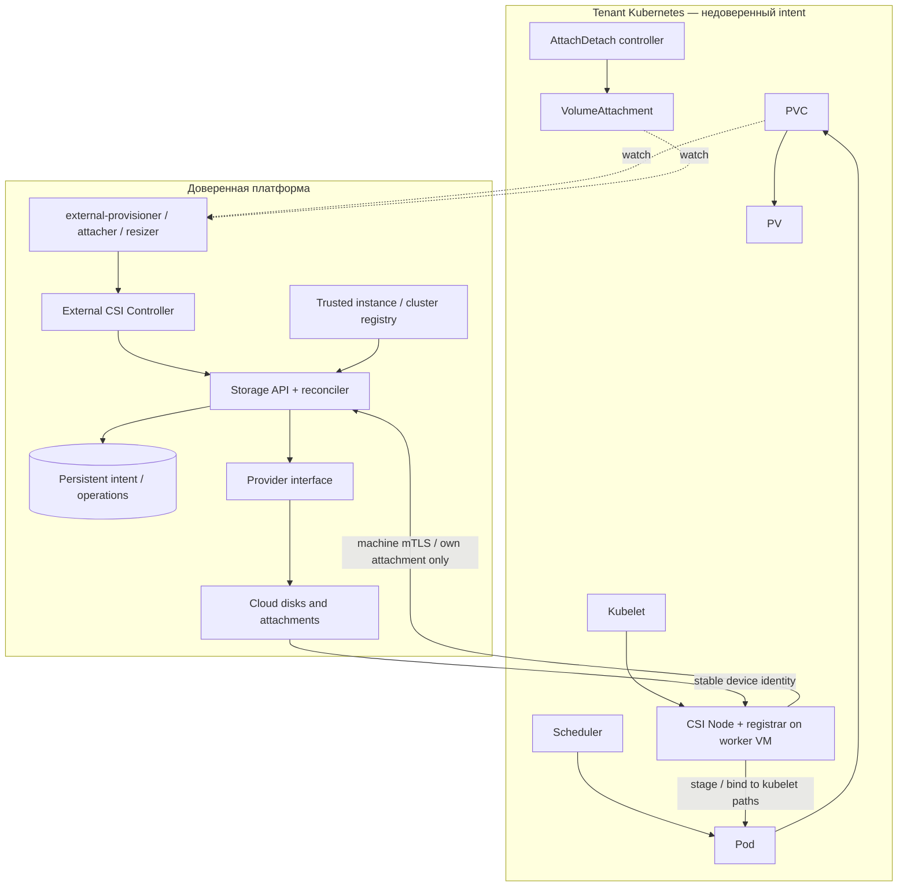
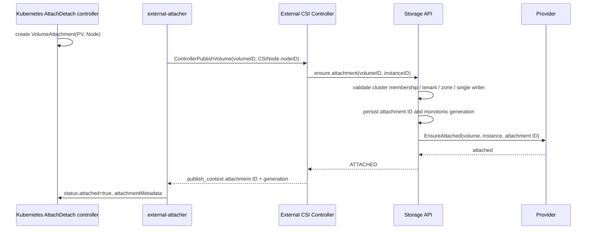
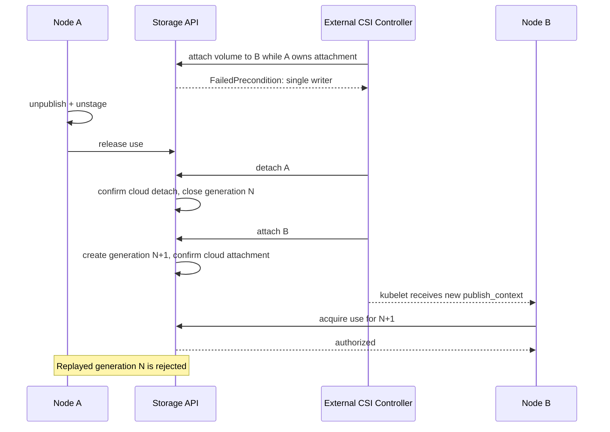
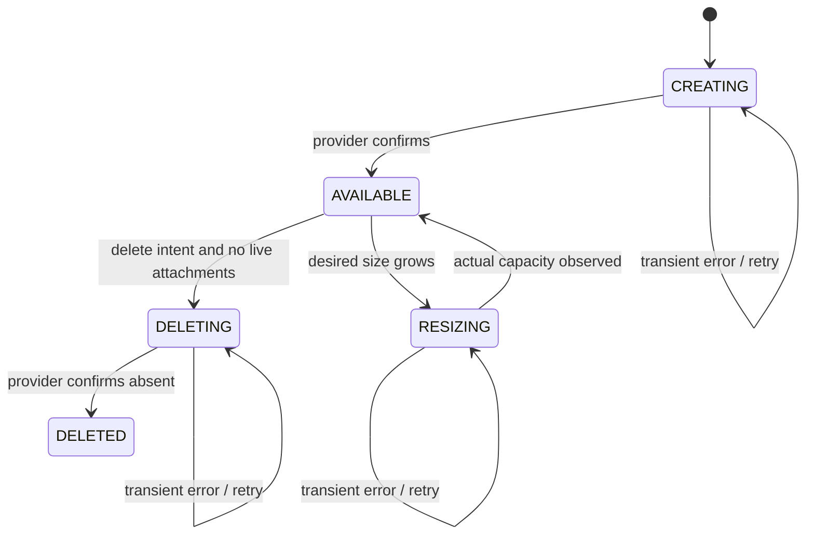
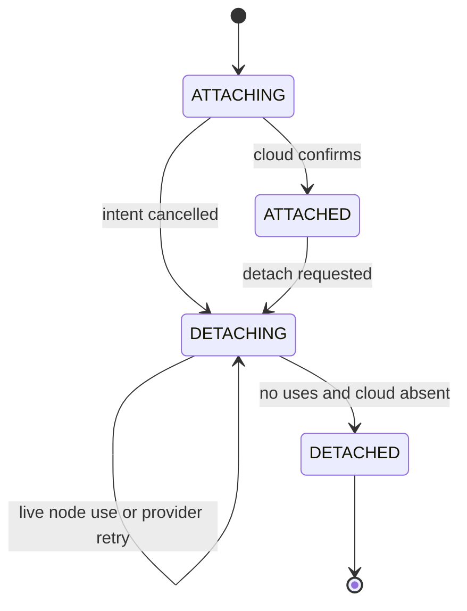

# Managed Kubernetes Storage: проект прототипа

Статус: проект до реализации; границы прототипа уточняются в README и отчёте проверки.
Приоритеты: tenant isolation → integrity → idempotency → recovery → стандартный CSI.

## 1. Компоненты и границы



Platform Storage Controller логически состоит из стандартных CSI sidecars,
внешнего CSI Controller adapter и Storage API reconciliation. Все три находятся
вне tenant cluster. Sidecars используют отдельный kubeconfig tenant API. Один
controller endpoint обслуживает ровно один cluster principal, выданный платформой.
Node Agent реализует Identity и Node; Controller service на его socket отсутствует.
Никаких Pod/PVC/PV watches на Node Agent. Kubelet VolumeManager не дублируется.

## 2. Создание PVC

```mermaid
sequenceDiagram
 participant U as User
 participant K as Tenant API / scheduler
 participant P as external-provisioner
 participant C as External CSI Controller
 participant S as Storage API
 participant B as Provider
 U->>K: PVC + Pod; WaitForFirstConsumer
 K->>K: choose candidate node / selected-node
 P->>K: read PVC, StorageClass, CSINode, topology
 P->>C: CreateVolume(name=pvc-UID, capabilities, topology)
 C->>S: create intent, mTLS cluster identity
 S->>S: tenant/cluster policy + durable idempotency key
 S->>B: EnsureVolume(platform volume ID)
 B-->>S: actual size / stable device key
 S-->>C: AVAILABLE
 C-->>P: volumeHandle + accessible_topology
 P->>K: PV + claim binding
 K->>K: finish Pod scheduling
```

При WFFC выбор candidate node предшествует созданию volume; окончательное
назначение Pod может следовать после binding. Не требуется собственный watch Pod.

## 3. Attach



Node/CSINode/providerID — недоверенные подсказки. Доверенный inventory проверяет,
что immutable VM принадлежит tenant и cluster controller principal. Подмена
CSINode не даёт доступ к чужому tenant; подмена на другую VM того же cluster может
вызвать отказ в обслуживании внутри собственного tenant. Для проверки конкретного
Node name/UID production adapter сверяет platform registration, а не только labels.

## 4. Mount

```mermaid
sequenceDiagram
 participant K as kubelet
 participant N as CSI Node
 participant S as Storage API
 participant H as Local host
 K->>N: NodeStageVolume(volumeID, stagingTargetPath, publish_context)
 N->>S: acquire durable use(attachment ID, generation)
 S->>S: mTLS instance = attachment instance; state ATTACHED
 S-->>N: volume policy + trusted stable device key
 N->>H: discover / validate signature / optional first format / stage
 N-->>K: success
 K->>N: NodePublishVolume(targetPath, capability, Pod info)
 N->>S: revalidate active attachment + record Pod UID for audit
 N->>H: bind stage to target; block mode binds device
 N-->>K: success
```

`publish_context` передаётся через стандартный VolumeAttachment attachmentMetadata.
Это ссылка на авторизацию, а не bearer token. Обязательна online проверка с machine
identity; volume_context и Pod UID сами по себе не являются доверенными credentials.
Pod info появляется в NodePublishVolume, не гарантирован в NodeStageVolume.

## 5. Detach

```mermaid
sequenceDiagram
 participant K as kubelet
 participant N as CSI Node
 participant A as External attacher/controller
 participant S as Storage API
 participant B as Provider
 K->>N: NodeUnpublishVolume(each target)
 N->>N: remove target mounts, persist journal
 K->>N: NodeUnstageVolume
 N->>N: unmount stage; verify targets absent
 N->>S: release durable use after local cleanup
 A->>S: request detach
 S->>S: DETACHING; reject new acquisitions
 Note over S: Existing use blocks cloud detach indefinitely
 S->>B: Detach only when no durable use remains
 B-->>S: absent
 S-->>A: DETACHED
```

Detach может прийти раньше unstage: атомарный переход в DETACHING закрывает новые
mount authorizations; существующий use блокирует provider detach. Release разрешён
в DETACHING. Никакого TTL, разрешающего detach из-за network partition. Потерянный
node требует доказанного cloud fencing/power-off до административного recovery.
Прототип не предоставляет опасного force-release endpoint.

## 6. Reschedule



## 7–8. Модель Volume и Attachment

Volume: `id`, `tenantID`, `clusterID` (orchestrator scope), `name` (idempotency),
`sizeBytes`, `desiredSizeBytes`, `type`, `region`, `zone`, `state`, `generation`,
`mode`, `fsType`, `allowFormat`, `deviceKey`, `deleteRequested`, `lastError`.
Provider resource ID скрыт в provider state; volumeHandle — opaque platform ID.
Generation volume — монотонный счётчик attachment incarnation.

Attachment: `id`, `tenantID`, `clusterID`, `volumeID`, `instanceID`, `generation`,
`state`, `deleteRequested`, `uses` (durable node-use set), `lastError`.
Use: immutable attachment generation + staging path fingerprint; не lease с TTL.
Operational state и audit records — отдельные buckets. Tombstones сохраняют ID и
idempotency history после удаления; никакого volume.attachedTo как источника истины.
Дальнейшее расширение: access policy, encryption profile, source snapshot, QoS,
replication policy — отдельные поля/ресурсы; attachment остаётся самостоятельным.

## 9. Storage API

HTTPS + обязательный mTLS, TLS >=1.3. URI SAN principal сверяется с доверенным
registry; tenant/cluster/instance не берутся из тела запроса или tenant labels.
Подробный wire contract: [api.md](api.md). Минимальные операции: Create/Get/Delete/
ResizeVolume, Create/Get/DeleteAttachment, GetInstance. Node endpoints дают только
own-instance self info, acquire/check/release attachment use и Pod audit.
Все вызовы provider идемпотентны по platform ID. Write intent фиксируется до cloud
operation. Timeout означает unknown outcome; reconcile читает actual state.

## 10. CSI Node contract

| RPC | Контракт |
|---|---|
| NodeGetInfo | immutable VM ID и platform region/zone из authenticated self API |
| NodeGetCapabilities | stage/unstage, expand, stats |
| NodeStageVolume | validate proof → acquire use → discover → safe stage |
| NodePublishVolume | validate same proof/capability → bind kubelet target |
| NodeUnpublishVolume | idempotent target cleanup; unknown targets не удаляются |
| NodeUnstageVolume | refuse with live targets → unmount → release use |
| NodeExpandVolume | check active attachment; device size before FS grow |
| NodeGetVolumeStats | only tracked paths; bytes/inodes for filesystem |

Identity: GetPluginInfo, GetPluginCapabilities, Probe на обоих endpoints. Global
capabilities совпадают. Только SINGLE_NODE_WRITER; это несколько Pods на одной VM,
не Kubernetes ReadWriteOncePod. Filesystem ext4/xfs и Block. Secrets не нужны.
Ошибки: InvalidArgument, NotFound, AlreadyExists, PermissionDenied,
FailedPrecondition, Aborted, Unavailable; повтор не заменяет validation.

## 11–13. Identity, topology и authorization

`Node.spec.providerID=cloud://<region>/<instance-id>`,
`NodeGetInfo.node_id=<instance-id>`; registrar/kubelet формируют CSINode.
Hostnames и Node UID не используются как VM identity. Machine certificate URI
`spiffe://storage.example.cloud/node/<instance-id>`; controller URI
`spiffe://storage.example.cloud/controller/<cluster-id>`. Сертификат выдаёт platform
CA через bootstrap identity, вне tenant control. Renewal/revocation — production work.

Topology keys: `topology.storage.example.cloud/{region,zone}`. Создание выбирает
разрешённую комбинацию requisites/preferred, provider inventory ограничивает зоны.
Attach повторно проверяет region/zone на API. StorageClass WFFC + allowVolumeExpansion.
Production policy ограничивает types, capacity, quota, rate и allowed zones на API.

Threat model: cluster-admin может подделать PV, VA, CSIDriver, Pod context и Node.
Все они intent. mTLS principal → registry → ownership является authority.
Worker VM принадлежит одному tenant. Cluster-admin с privileged Pod/hostPath может
получить root внутри своей VM, заменить Node Agent и обойти его локальные проверки.
Поэтому строгая cross-tenant граница обеспечивается cloud/hypervisor attachment и
API; нельзя обещать защиту Linux mount от root самой VM. API node principal не имеет
cloud mutation прав и не может читать чужие attachments. Pod UID полезен для audit,
но не доказывает аутентичность Pod перед полностью недоверенным tenant control plane.

## 14. Retry / reconciliation

Durable desired state → provider actual observation → converge → persist status.
Prototype: single writer API, bbolt file lock, timer loop, immutable operation IDs,
provider emulator со своим persistent DB. Повтор не создаёт новые ресурсы. Errors
сохраняются; transient сбои повторяются. Cloud timeout не очищает intent.
Production: PostgreSQL transactions, unique partial index active attachment(volume),
per-volume locks/fencing epoch, outbox operations, jittered bounded exponential
backoff, worker leases + fencing; HA replicas и leader election per cluster sidecars.
Нельзя запустить несколько API replicas поверх одного bbolt файла как HA.

## 15–16. State machines



Attach не меняет volume.state: ATTACHING/ATTACHED — состояния отдельной сущности.
Aggregate UI может вычислять их из attachments. `lastError` ортогонален lifecycle.



## 17. Failure matrix

| Сбой/гонка | Поведение |
|---|---|
| Pod deleted/rescheduled during attach | VA deletion requests detach; finish/cancel converge, never second writer |
| VM deleted during attach | registry active=false denies new use; cloud fencing before cleanup |
| Node NotReady / network partition | preserve uses, no detach by timeout |
| detach before unpublish | DETACHING stops acquisitions; active use blocks detach |
| restart after cloud attach before status | EnsureAttached with same ID discovers result |
| late device appearance | bounded discovery retry; use retained conservatively |
| platform ATTACHED, cloud absent | without uses repair; with uses mark error and require fenced recovery |
| cloud attached, DB state lost | restore DB/audit; unknown resources quarantine, never infer ownership from tenant PV |
| disk on deleted VM | verify deletion/power-off at compute API, detach/reconcile |
| mount but Pod absent | kubelet cleanup; platform never calculates Pod targetPath |
| deleting volume still attached | reject deletion until all attachments DETACHED |
| node restart after local mount | persistent journal written before side effect; retry same paths |
| lost node journal | fail closed; restore journal or offline/fenced recovery |
| stale generation / foreign volume | deny before device operation; security audit |
| duplicate events / retries | same ID, same config succeed; config mismatch fails |

Recovery requiring fencing/quarantine is designed, not automated in the emulator.

## 18. Filesystem and local privilege threat model

Trusted device key comes from API, never PV volume_context. Production provider
exposes serial/WWN by `/dev/disk/by-id`; order-dependent /dev/vdX is forbidden.
Linux backend resolves symlink, requires block device, probes all signatures.
Only API-created blank volume with allowFormat permits first mkfs; known signatures,
partition table, unknown FS, or FS mismatch prevent destructive format. ext4/xfs
only; no force-format flags. No automatic repairing fsck in MVP. XFS repair and
ext4 offline fsck require explicit operational policy. Block never formats.
Paths must be absolute descendants of configured kubelet root, symlink components
rejected. Node accepts only supplied paths; no Pod API access. Node socket and journal
root-owned; mount namespace must match kubelet or provide bidirectional propagation.
Prototype Linux backend is opt-in, privileged, and requires isolated VM validation.
A root-capable hostile process defeats in-guest pathname checks: this is outside the
local path hardening guarantee, but must not defeat cross-tenant cloud authorization.

## 19. Kubernetes resources / watches / finalizers

| Component | Watches / writes |
|---|---|
| external-provisioner | PVC, PV, StorageClass, Node, CSINode; provisioning finalizer |
| external-attacher | VolumeAttachment, PV, Node/CSINode; VA status/finalizer |
| external-resizer | PVC/PV (Pods only if configured for in-use error handling); resize status |
| kubelet + built-in ADC | Pod placement, CSI lifecycle, VolumeAttachment intent |
| custom Controller adapter | no Kubernetes watch; CSI RPC → platform API |
| Node Agent | no Kubernetes API credentials or watches |

No extra platform CRD in tenant cluster. `CSIDriver.attachRequired=true`,
`podInfoOnMount=true`, `volumeLifecycleModes=[Persistent]`, `fsGroupPolicy=None`
(prototype does not implement ownership management). Standard PV reclaimPolicy Delete
or Retain. StorageClass parameters are untrusted, API validates allowlisted values.
Finalizers are operational coordination, not security: cluster-admin can remove them.
Persistent platform inventory remains even if Kubernetes objects disappear. Production
orphan GC requires retention policy/audit reconciliation, not immediate deletion.
No automatic finalizer removal on timeout; platform incident recovery must resolve
cloud state/fencing and explicitly retire stuck resources.

## 20. MVP и дальнейшая реализация

Target MVP: dynamic provisioning, deletion, single-node attach/detach, ext4/xfs,
Block, resize, zone topology, stats, ownership and attachment authorization,
idempotent reconciliation. No snapshots/clones/shared FS/multi-writer/backups/
cross-zone/encryption management/QoS. Independent Provider interface allows future
VM/KubeVirt/non-Kubernetes adapters against the same Storage API.

Prototype demonstrates contracts and failure handling with persistent emulated cloud
and local simulated host; optional Linux host operations are not a cloud provider.
Production prerequisites: real provider inventory/discovery, HA database, machine
identity issuer/rotation, quotas, full integration tests, metrics/traces, fencing,
robust device and journal recovery, deployment hardening and CSI conformance suite.

Observability target: duration histograms volume_create/delete, attachment_create/
delete, node_stage/publish, disk_discovery; mount_errors_total, attachment_errors_total.
Bound labels region/zone/operation/error_class; tenant only in controlled per-tenant
registry (tenant itself can be high cardinality). IDs/Pod UID only in structured audit
and traces. End-to-end Kubernetes events are linked by object IDs/request IDs; CSI
has no universal trace propagation field, so use span links at RPC boundaries.
Security audit: foreign volume, instance/tenant mismatch, stale generation, missing
active attachment. Audit bucket separate from current state, production export append-only.

## Источники

- [CSI specification v1.13.0](https://github.com/container-storage-interface/spec/blob/v1.13.0/spec.md)
- [external-provisioner](https://github.com/kubernetes-csi/external-provisioner)
- [external-attacher](https://github.com/kubernetes-csi/external-attacher)
- [external-resizer](https://github.com/kubernetes-csi/external-resizer)
- [CSIDriver](https://kubernetes-csi.github.io/docs/csi-driver-object.html)
- [Pod info on mount](https://kubernetes-csi.github.io/docs/pod-info.html)

Проверено 2026-09-16. Sidecar release versions и Kubernetes compatibility необходимо
зафиксировать и проверить вместе при запуске реального cluster integration.
